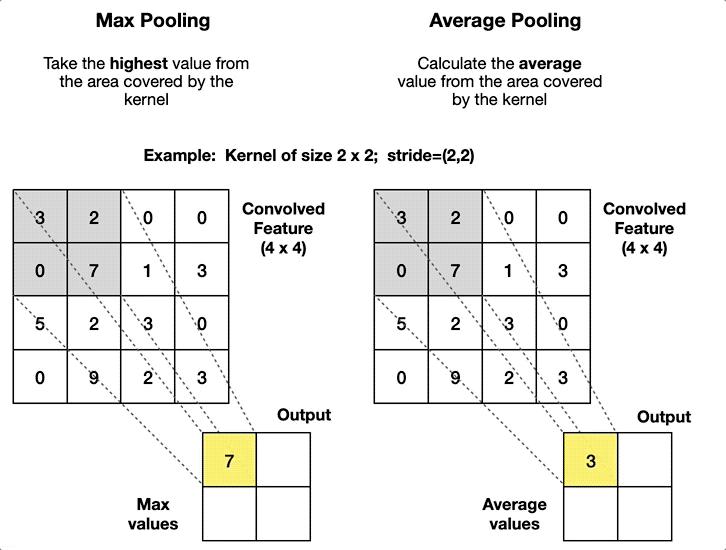
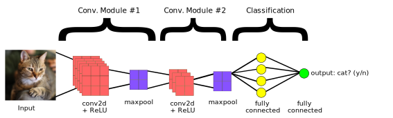

### **Neural Network Architecture** 🧠  

The image represents a **basic neural network** with three key layers:  

1️⃣ **Input Layer** – Receives raw data (e.g., images, text, numbers). Each neuron represents an input feature.  

2️⃣ **Hidden Layers** – Extract patterns using mathematical transformations. More layers = **deeper network**.  

3️⃣ **Output Layer** – Produces final predictions.  
   - **Regression**: Single neuron (continuous value).  
   - **Binary Classification**: One neuron (sigmoid activation).  
   - **Multi-class Classification**: Multiple neurons (softmax activation).  

🔹 **Fully Connected Network (FCN)** – Every neuron in a layer connects to every neuron in the next.  

  

# 🚀 Convolutional Neural Networks (CNNs)

## 📌 Introduction
Convolutional Neural Networks (CNNs) are a class of deep learning models widely used for image recognition, object detection, and other visual tasks.

## 🔍 How CNNs Work
A CNN consists of multiple layers that extract and process image features. The key layers include:

### 🖼 CNN Process: From Input Image to Classification

This diagram illustrates how a Convolutional Neural Network (CNN) processes an input image, extracts features, and classifies it into a category.

### **Convolutional Neural Network (CNN) Pipeline** 🖼️🔍  

A CNN processes images in **five main steps**:  

1️⃣ **Input Image** – The raw image is represented as a matrix of pixel values.  
2️⃣ **Filters** – Small matrices slide over the input to detect features (edges, textures).  
3️⃣ **Convolution Layers** – Apply filters to extract complex patterns.  
4️⃣ **Pooling** – Reduces dimensionality while keeping important features.  
5️⃣ **Feed-Forward Layer** – Final classification using a fully connected neural network.  

🔹 CNNs excel in **image recognition, object detection, and pattern analysis**

### **Filters, Stride & Padding in CNN** 🎯🖥️  

  

🔹 **Filter (Kernel)**: Slides over the input matrix to extract features.  
🔹 **Stride**: Controls how much the filter moves at each step.  
🔹 **Padding**: Adds extra borders to maintain dimensions.  
🔹 **Output**: Feature map generated based on input & filter.  

CNNs use these operations to detect edges, textures, and patterns efficiently! 

### **Applying Filters in CNN** 🎯🔍  

  

🔹 **Filter (Kernel)**: A small matrix that slides over the image.  
🔹 **Convolution Operation**: Multiplies filter values with image pixels and sums them up.  
🔹 **Feature Map**: Resulting matrix highlighting important patterns.  

Filters help CNNs detect edges, textures, and structures!   

# Convolutional Neural Networks (CNNs): Filters, Stride, and Pooling

## 1. Convolution Operation with Filters
The convolution operation applies a filter (kernel) to an input image to detect features such as edges, textures, and patterns. The filter slides over the image, performing element-wise multiplications and summing up the values.

### Example:
In the image below, a **3×3 filter** is applied to a section of the input image.

### Key Concepts:
- **Filter (Kernel)**: A small matrix used to transform the input.
- **Stride**: Defines how much the filter moves across the input.
- **Padding**: Adds extra pixels around the border to control output size.

##  Pooling Layers
Pooling is used to reduce the spatial dimensions of feature maps while retaining the most important information.

### (a) Average Pooling
Average pooling calculates the mean of pixel values within a defined window (e.g., **2×2 filter with stride 2**).

### (b) Max Pooling vs. Average Pooling
Max pooling selects the highest value from the feature map region, while average pooling computes the mean.

### Benefits of Pooling:
- Reduces computation by decreasing feature map dimensions.
- Helps with translational invariance.
- Prevents overfitting.

Convolutional layers and pooling layers work together to extract meaningful features from images while reducing computational complexity. Understanding these concepts is essential for building **CNN models** for image classification and object detection.

### Flattening
Flattening converts the **pooled feature maps** into a **1D vector**, which is then passed to a **fully connected layer**.

Example:

Flattening helps in connecting CNN features to a fully connected layer, allowing classification.

# Fully Connected Layers in Deep Learning

Fully Connected (FC) layers are used in deep neural networks to connect every neuron in one layer to every neuron in the next layer. These layers play a crucial role in classification and regression tasks.

## Fully Connected Layers Visualization

<table>
    <tr>
        <td></td>
        <td></td>
    </tr>
    <tr>
        <td align="center"><b>Fully Connected Layers</b></td>
        <td align="center"><b>Fully Connected Layers with Dropout</b></td>
    </tr>
</table>

### Key Differences:
1. **Fully Connected Layers**:
   - Every neuron is connected to all neurons in the next layer.
   - Helps extract global patterns from the flattened input.
   - Used for classification in Convolutional Neural Networks (CNNs).
  
2. **Fully Connected Layers with Dropout**:
   - Includes dropout to randomly deactivate neurons.
   - Helps prevent overfitting and improves generalization.
   - Common in deep learning models to enhance performance.

---

### Summary:
- **FC layers** transform extracted features into final predictions.
- **Dropout** prevents the model from relying too much on specific neurons.
- Used in **image classification, NLP, and various deep learning applications**.

# Convolutional Neural Network (CNN)

## CNN Processing Pipeline

This diagram illustrates how a CNN extracts features using **convolution**, **ReLU activation**, and **pooling layers**. The extracted features pass through **fully connected layers**, leading to the **output layer** with class probabilities.

---

## CNN Output Layer

The **output layer** applies an **activation function** (e.g., Softmax) to produce class probabilities, making the final prediction.

